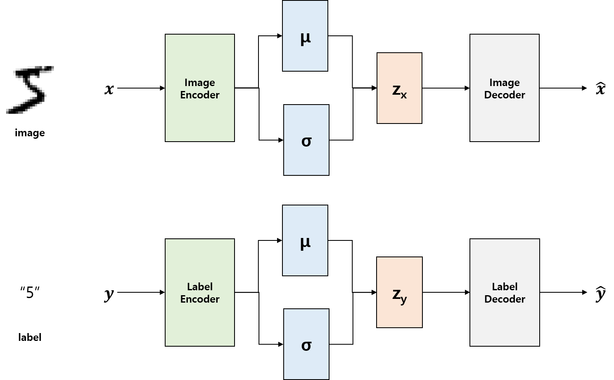
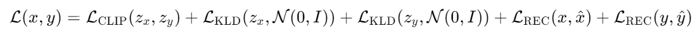

## CLIP-VAE: Combining CLIP and VAE for Image Generation

This repository offers the implementation code for CLIP-VAE, an innovative model that merges OpenAI's CLIP[1] and Variational Autoencoder (VAE)[2] for image generation. The model is composed of two essential components.

Firstly, CLIP, a robust vision model developed by OpenAI, is employed for the purpose of comprehending and categorizing images. The original CLIP model was designed to acquire knowledge about the connection between images and text, whereas in this context, we aim to learn the association between images and labels.

Secondly, the Variational Autoencoder (VAE) is an adept generative model utilized to encode and decode data efficiently within a latent space, thereby generating novel data. The VAE is designed to learn the underlying distribution of the data, facilitating the production of a wide range of samples by means of continuous interpolation within the latent space.

CLIP-VAE integrates these two components to tackle the task of image generation. The VAE takes on the responsibility of generating images within the latent space, while CLIP is employed to assess their alignment with specific concepts. This combined approach ensures the preservation of desired features and enhances the overall quality of the generated images.

This repository encompasses all the essential code and example datasets, such as MNIST, required for training the CLIP-VAE model and generating images. Furthermore, it offers tools and example code that facilitate the visualization of the training process for the model. By leveraging this codebase and the accompanying examples, you can implement and train your very own CLIP-VAE model, ultimately enabling you to generate images according to your specific preferences.

### Model
The model architecture of CLIP-VAE closely resembles that of a conventional VAE.

<figure>
    
    <figcaption><b>Figure: Model architecture</b></figcaption>
</figure>

However, it introduces a significant distinction by incorporating an additional loss term that quantifies the difference between the latent vectors of images and their respective labels. This augmented loss term incentivizes the model to acquire a latent space representation that not only captures image reconstruction capabilities but also maintains the semantic relationship between an image and its corresponding label. By integrating this loss term, CLIP-VAE achieves a holistic understanding of both visual and semantic aspects, enabling it to generate images that align with their intended labels while preserving their inherent image characteristics.

The overall loss term is defined as follows:

<figure>
    
</figure>

Here, $\mathcal L_{\mathrm CLIP}$ represents the CLIP loss, which is defined by [1]. $\mathcal{L}_\mathrm{KLD}$ refers to the Kullback-Leibler divergence between the latent vector $z$ and a standard normal distribution $\mathcal{N}(0, I)$. $\mathcal{L}_\mathrm{REC}$ denotes the reconstruction loss.

In this loss formulation, the CLIP loss term encourages alignment between the latent vectors $z_x$ and $z_y$, capturing the semantic relationship between the image $x$ and its associated label $y$. The KLD terms regularize the latent vectors by ensuring they adhere to a standard normal distribution. Finally, the reconstruction loss terms $\mathcal{L}_\mathrm{REC}$ measure the dissimilarity between the original inputs ($x$ and $y$) and their corresponding reconstructions ($\hat{x}$ and $\hat{y}$).

By optimizing this combined loss function, CLIP-VAE learns to generate images that both align with their labels and exhibit strong reconstruction fidelity.

### Reference
1. Radford, Alec, et al. "Learning transferable visual models from natural language supervision." International conference on machine learning. PMLR (2021)
2. Kingma, Diederik P., and Max Welling. "Auto-encoding variational bayes." arXiv preprint arXiv:1312.6114 (2013)
